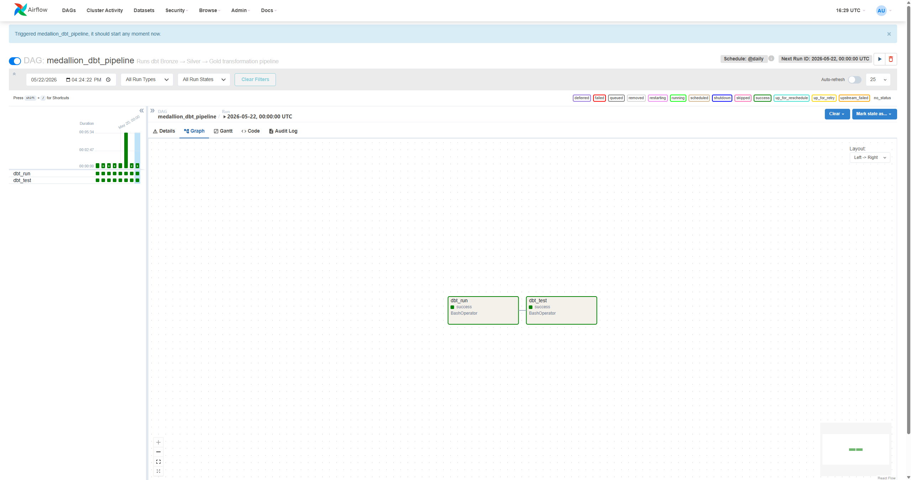
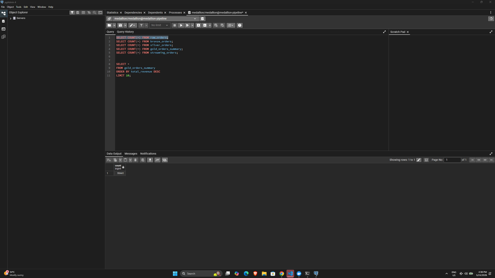
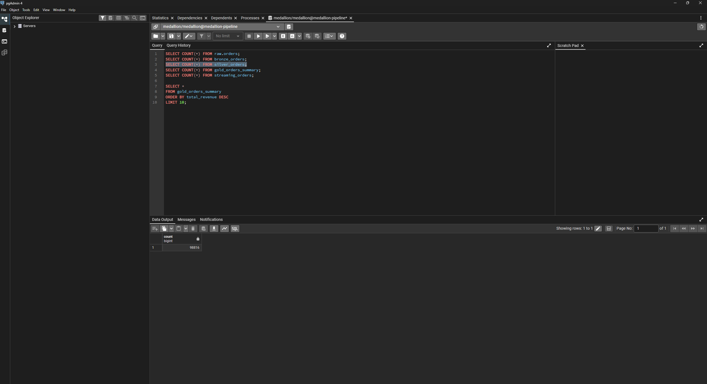
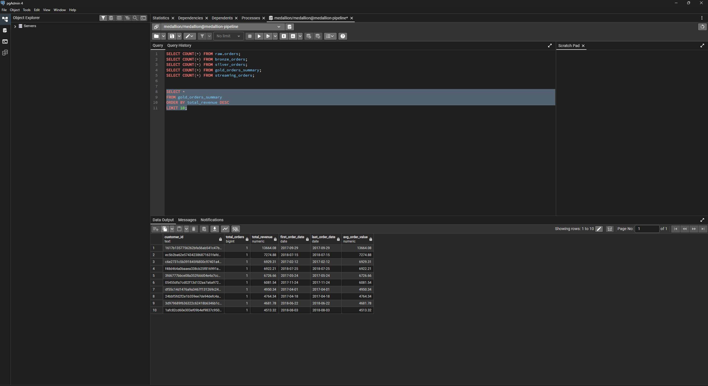
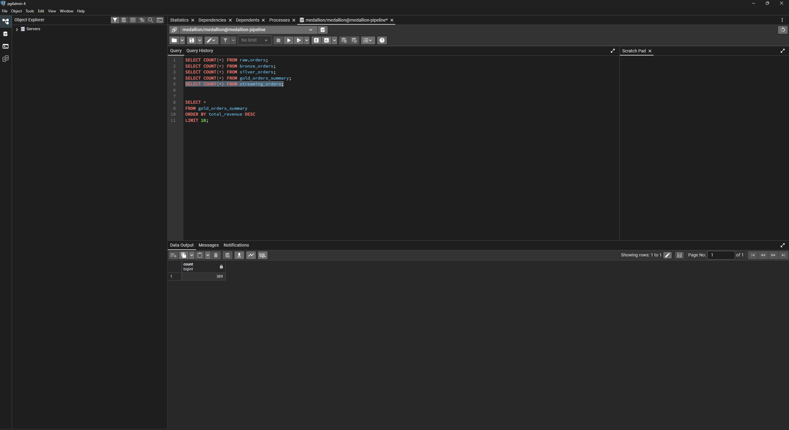

# Medallion Data Pipeline

A hybrid batch + streaming data engineering project built with **dbt Core**, **PostgreSQL**, **Apache Airflow**, **Redpanda**, **PySpark**, and **Docker**. This pipeline ingests historical ecommerce batch data from the Olist dataset alongside simulated real-time retail events, then transforms the data through Bronze → Silver → Gold layers for analytics-ready output.

---

## Architecture Overview

```
BATCH PATH
──────────────────────────────────────────────────────
Olist CSV Files
  └── load_olist_orders.py (Python + pandas + psycopg2)
        └── PostgreSQL: raw.orders
              └── dbt Bronze: bronze_orders (raw alias)
                    └── dbt Silver: silver_orders (cleaned + typed)
                          └── dbt Gold: gold_orders_summary (customer aggregations)

STREAMING PATH
──────────────────────────────────────────────────────
producer.py (Faker-generated retail events)
  └── Redpanda topic: retail_orders
        └── consumer.py
              └── PostgreSQL: streaming_orders

ORCHESTRATION
──────────────────────────────────────────────────────
Apache Airflow DAG: medallion_dbt_pipeline
  └── dbt_run → dbt_test
```

---

## Tech Stack

| Layer | Tool |
|---|---|
| Transformation | dbt Core 1.8.0 |
| Database | PostgreSQL (via Docker) |
| Orchestration | Apache Airflow |
| Streaming broker | Redpanda (Kafka-compatible) |
| Batch processing | PySpark / Python + pandas |
| Containerization | Docker + Docker Compose |
| Python libraries | psycopg2, kafka-python, Faker, pandas |

---

## Project Structure

```
medallion-pipeline/
├── dags/
│   └── medallion_dbt_dag.py          # Airflow DAG: dbt run + dbt test
├── medallion_dbt/
│   ├── models/
│   │   ├── bronze/
│   │   │   └── bronze_orders.sql     # Raw alias over raw.orders
│   │   ├── silver/
│   │   │   └── silver_orders.sql     # Cleaned, typed, standardized
│   │   └── gold/
│   │       └── gold_orders_summary.sql  # Customer-level aggregations
│   ├── schema.yml                    # dbt automated schema tests
│   └── profiles.yml                  # dbt connection config
├── data/
│   └── raw/
│       ├── olist_orders_dataset.csv
│       └── olist_order_payments_dataset.csv
├── producer.py                       # Generates synthetic retail events → Redpanda
├── consumer.py                       # Reads Redpanda events → PostgreSQL streaming_orders
├── load_olist_orders.py              # Batch loader: Olist CSV → raw.orders
├── docker-compose.yml
└── README.md
```

---

## Batch Flow

The batch path uses two files from the [Olist Brazilian E-Commerce dataset](https://www.kaggle.com/datasets/olistbr/brazilian-ecommerce):

- `olist_orders_dataset.csv` — order IDs, customer IDs, statuses, purchase timestamps
- `olist_order_payments_dataset.csv` — payment values per order

`load_olist_orders.py` joins these two datasets, derives `total_amount` by aggregating payment values per order, and loads the final result into PostgreSQL as `raw.orders`.

**raw.orders schema:**

| Column | Type | Source |
|---|---|---|
| order_id | TEXT | olist_orders_dataset |
| customer_id | TEXT | olist_orders_dataset |
| order_date | TIMESTAMP | order_purchase_timestamp |
| status | TEXT | order_status |
| total_amount | NUMERIC | sum of payment_value |
| created_at | TIMESTAMP | order_purchase_timestamp |

**Total rows loaded: 99,441**

---

## Streaming Flow

The streaming path simulates real-time retail order events using Python and Faker.

- `producer.py` generates synthetic orders with fields: order ID, store ID, city, product, category, quantity, total amount, and timestamp. Events are published to the Redpanda topic `retail_orders`.
- `consumer.py` reads events from `retail_orders` and inserts them into PostgreSQL as `streaming_orders`.

This demonstrates how the pipeline handles both historical batch data and live incoming events concurrently.

---

## dbt Transformation Layers

### Bronze — `bronze_orders`

A clean alias over `raw.orders`. No transformation is applied at this layer — it preserves the raw source structure and acts as the entry point for all downstream models.

```sql
select order_id, customer_id, order_date, status, total_amount, created_at
from raw.orders
```

### Silver — `silver_orders`

Cleans and standardizes the raw data:
- Casts `order_date` to `DATE` and `total_amount` to `NUMERIC`
- Filters out cancelled orders
- Maps raw Olist statuses into two business-friendly categories:
  - `COMPLETED` → `DELIVERED`, `SHIPPED`, `INVOICED`
  - `PENDING` → `APPROVED`, `CREATED`, `PROCESSING`, `UNAVAILABLE`

### Gold — `gold_orders_summary`

Customer-level aggregations from `silver_orders`:

| Column | Description |
|---|---|
| customer_id | Unique customer identifier |
| total_orders | Number of orders placed |
| total_revenue | Sum of all order amounts |
| first_order_date | Date of earliest order |
| last_order_date | Date of most recent order |
| avg_order_value | Average spend per order |

---

## Automated Tests (dbt)

The `schema.yml` file defines automated tests that run with `dbt test`:

- **not_null** on `order_id`, `customer_id`, `total_amount`
- **unique** on `order_id`
- **accepted_values** on `silver_orders.status` — only `COMPLETED` or `PENDING` allowed

All 10 tests pass after the Silver layer standardization.

---

## Airflow DAG

**DAG ID:** `medallion_dbt_pipeline`

**Schedule:** `@daily`

**Tasks:**

```
dbt_run → dbt_test
```

Both tasks run inside the Airflow container, pointing to `/opt/airflow/medallion_dbt` for the dbt project and profiles.

---

## How to Run

### 1. Start all services

```bash
docker compose up -d
```

Wait 30 seconds and verify all containers are running:

```bash
docker compose ps
```

### 2. Load Olist batch data

Ensure the Olist CSV files are in `data/raw/`, then run:

```bash
python load_olist_orders.py
```

Expected output:

```
Loaded 99441 rows into raw.orders
```

### 3. Run the streaming flow

Open two separate terminals:

```bash
# Terminal 1 — start consumer first
python consumer.py

# Terminal 2 — start producer
python producer.py
```

### 4. Trigger the Airflow DAG

Open Airflow at `http://localhost:8080`, find `medallion_dbt_pipeline`, and trigger it manually. Both `dbt_run` and `dbt_test` should complete green.

---

## Verification Queries

Run these in pgAdmin or any PostgreSQL client to confirm the full pipeline:

```sql
-- Row counts per layer
SELECT COUNT(*) FROM raw.orders;              -- 99,441
SELECT COUNT(*) FROM bronze_orders;
SELECT COUNT(*) FROM silver_orders;
SELECT COUNT(*) FROM gold_orders_summary;
SELECT COUNT(*) FROM streaming_orders;

-- Gold output: top customers by revenue
SELECT *
FROM gold_orders_summary
ORDER BY total_revenue DESC
LIMIT 10;

-- Streaming: latest events
SELECT *
FROM streaming_orders
ORDER BY order_timestamp DESC
LIMIT 10;
```

---

## Screenshots

> Add your screenshots to the `assets/` folder and reference them below.

| What | Screenshot |
|---|---|
| Airflow DAG — dbt_run and dbt_test green |  |
| raw.orders row count |  |
| silver_orders sample rows |  |
| gold_orders_summary top 10 |  |
| streaming_orders live events |  |

---

## Key Learnings

- How to design a Medallion architecture pipeline end to end using dbt Core with layer-specific materializations (views for Bronze/Silver, tables for Gold).
- How to integrate Apache Airflow with dbt for orchestration and automated schema testing.
- How to build both a batch ingestion path (Olist CSV → PostgreSQL) and a streaming path (Redpanda → PostgreSQL) in one unified project.
- How to debug and fix common issues across Docker, Airflow, dbt, and PostgreSQL — including schema mismatches, view dependency conflicts, and status standardization failures.
- How to use `accepted_values` dbt tests to enforce data quality rules across transformation layers.

---

## Author

Built by Parag T. as a portfolio data engineering project.  
[LinkedIn](https://www.linkedin.com/in/paragtippannawar/) · [GitHub](https://github.com/ParagTippannawar)
